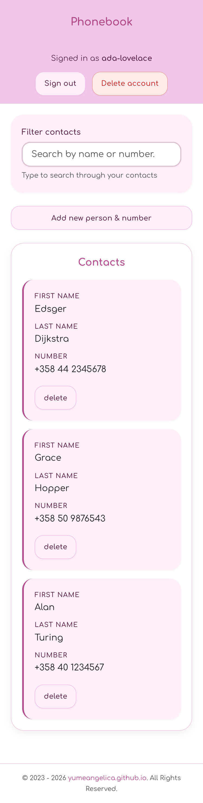
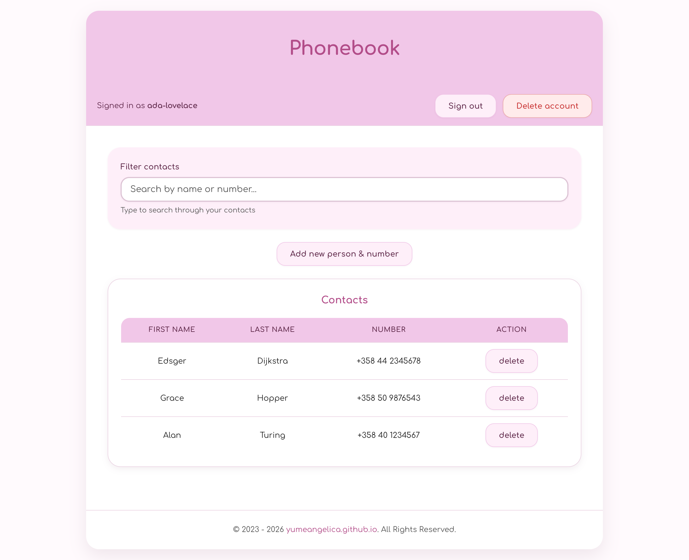

# Fullstack Phonebook Application


A modern phonebook application with user authentication, real-time validation, international phone number support, and comprehensive testing. Built with React, Node.js, Express, and MongoDB.

Originally created for the Full Stack Open course in 2023, significantly modernized and enhanced in 2026 with improved architecture, authentication, validation, testing, and production-ready features.

## Features

- **User authentication** — register, login, logout, and delete account
- **Per-user phonebook** — each user has their own private contacts
- Add, edit, delete, and search contacts
- Real-time form validation with visual feedback
- International phone number validation with country codes
- Finnish phone number normalization (removes leading zero)
- Mobile-first responsive design with self-hosted Comfortaa font
- Accessible UI — skip link, screen-reader labels, keyboard focus states, reduced-motion support
- Search and filter functionality (instant client-side filtering)
- REST API with pagination and search support (`page`/`limit`/`search` query params)
- Comprehensive error handling

## Screenshots

| Mobile | Desktop |
| --- | --- |
|  |  |

## Tech Stack

**Frontend:** React 19, Vite 8, libphonenumber-js
**Backend:** Express 5, MongoDB, Mongoose 9
**Runtime & tooling:** Bun (package manager, runtime, test runner)
**Auth:** jose (JWT HS256), bcrypt
**Testing:** `node:test` (run via `bun test`), supertest
**Linting & formatting:** Biome 2

## Quick Start

### Prerequisites

- [Bun](https://bun.sh) >= 1.3
- MongoDB (local or MongoDB Atlas)

### Installation

```bash
git clone https://github.com/yumeangelica/fullstack-phonebook-application.git
cd fullstack-phonebook-application
bun install
```

### Environment Setup

Copy `.env.example` to `.env` and fill in the values:

```bash
cp .env.example .env
```

```
NODE_ENV=development
MONGODB_URI=your-mongodb-uri
TEST_MONGODB_URI=your-test-mongodb-uri
JWT_SECRET=your-secret-key
PORT=5001
ALLOWED_ORIGINS=http://localhost:3000,http://127.0.0.1:3000
```

`JWT_SECRET` is required in production; the server refuses to start without a secure value.
`TEST_MONGODB_URI` must point to a separate test database because backend tests delete data.

### Development

```bash
bun run dev
```

Frontend: http://localhost:3000
Backend: http://localhost:5001

### Production

```bash
bun run build
bun start
```

## Scripts

- `bun run dev` - Start development servers (backend + frontend)
- `bun run build` - Build the frontend for production (Vite)
- `bun start` - Start production server
- `bun test` - Run all tests
- `bun run test:frontend` - Run React component tests
- `bun run test:backend` - Run API and model tests
- `bun run test:watch` - Run backend tests in watch mode
- `bun run lint` - Lint with Biome
- `bun run format` - Format with Biome
- `bun run check` - Lint, format, and apply safe fixes with Biome

## API Endpoints

### Authentication (public)

```
POST   /api/auth/register - Register a new user
POST   /api/auth/login    - Login and receive JWT token
```

### Authentication (requires token)

```
GET    /api/auth/me        - Get current user info
DELETE /api/auth/me        - Delete account and all contacts
```

### Contacts (requires token)

```
GET    /api/persons        - Get all contacts (with search/pagination)
POST   /api/persons        - Create new contact
GET    /api/persons/:id    - Get specific contact
PUT    /api/persons/:id    - Update contact
DELETE /api/persons/:id    - Delete contact
GET    /api/stats          - Get user's statistics
```

### Health (public)

```
GET    /health             - Health check
GET    /ready              - Readiness probe
GET    /live               - Liveness probe
```

## Validation

**Username:** 3-30 characters, lowercase letters, numbers, hyphens, underscores
**Password:** Minimum 8 characters
**Names:** 2-50 characters, letters/spaces/hyphens/apostrophes only, Unicode support
**Phone:** International format with country codes, real-world validation using libphonenumber-js

## Project Structure

```
├── client/              # React frontend
│   ├── components/      # React components with tests
│   ├── css/             # Styling
│   ├── hooks/           # Custom hooks (useAuth, usePersons, useNotification)
│   ├── services/        # API services (native fetch)
│   ├── utils/           # Validation utilities
│   └── test-setup.js    # jsdom setup for frontend tests
├── server/              # Express backend
│   ├── controllers/     # Route handlers (auth, api, health)
│   ├── middleware/      # Auth, error handling, logging, security
│   ├── models/          # Mongoose models (User, Person)
│   ├── tests/           # Backend tests (supertest)
│   └── utils/           # Config, database, and auth utilities
├── public/              # Static assets served as-is (self-hosted fonts)
├── biome.json           # Biome lint + format config
├── vite.config.js       # Vite build & dev server config
├── index.html           # HTML template
└── index.js             # Server entry point
```

## Credits

Created by yumeangelica (yumeangelica.github.io)

## License

MIT
